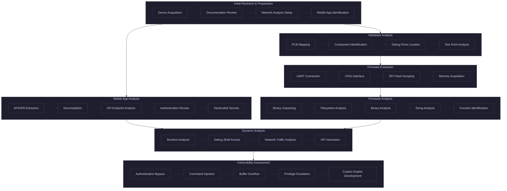

# iot-research

Repo for blog posts and tools for iot hacking.

# Methodology

```mermaid

flowchart TD
    subgraph Phase1["Initial Research & Preparation"]
        A1[Device Acquisition] --> A2[Documentation Review]
        A2 --> A3[Network Analysis Setup]
        A3 --> A4[Mobile App Identification]
        style Phase1 fill:#1e1e2e,stroke:#45475a,color:#cdd6f4
    end

    subgraph Phase2["Hardware Analysis"]
        B1[PCB Mapping] --> B2[Component Identification]
        B2 --> B3[Debug Ports Location]
        B3 --> B4[Test Point Analysis]
        style Phase2 fill:#1e1e2e,stroke:#45475a,color:#cdd6f4
    end

    subgraph Phase3["Mobile App Analysis"]
        C1[APK/IPA Extraction] --> C2[Decompilation]
        C2 --> C3[API Endpoint Analysis]
        C3 --> C4[Authentication Review]
        C4 --> C5[Hardcoded Secrets]
        style Phase3 fill:#1e1e2e,stroke:#45475a,color:#cdd6f4
    end

    subgraph Phase4["Firmware Extraction"]
        D1[UART Connection] --> D2[JTAG Interface]
        D2 --> D3[SPI Flash Dumping]
        D3 --> D4[Memory Acquisition]
        style Phase4 fill:#1e1e2e,stroke:#45475a,color:#cdd6f4
    end

    subgraph Phase5["Firmware Analysis"]
        E1[Binary Unpacking] --> E2[Filesystem Analysis]
        E2 --> E3[Binary Analysis]
        E3 --> E4[String Analysis]
        E4 --> E5[Function Identification]
        style Phase5 fill:#1e1e2e,stroke:#45475a,color:#cdd6f4
    end

    subgraph Phase6["Dynamic Analysis"]
        F1[Runtime Analysis] --> F2[Debug Shell Access]
        F2 --> F3[Network Traffic Analysis]
        F3 --> F4[API Interaction]
        style Phase6 fill:#1e1e2e,stroke:#45475a,color:#cdd6f4
    end

    subgraph Phase7["Vulnerability Assessment"]
        G1[Authentication Bypass] --> G2[Command Injection]
        G2 --> G3[Buffer Overflow]
        G3 --> G4[Privilege Escalation]
        G4 --> G5[Custom Exploit Development]
        style Phase7 fill:#1e1e2e,stroke:#45475a,color:#cdd6f4
    end

    Phase1 --> Phase2
    Phase1 --> Phase3
    Phase2 --> Phase4
    Phase3 --> Phase6
    Phase4 --> Phase5
    Phase5 --> Phase6
    Phase6 --> Phase7

    classDef default fill:#1e1e2e,stroke:#45475a,color:#cdd6f4
    classDef phase fill:#181825,stroke:#45475a,color:#cdd6f4
    class A1,A2,A3,A4,B1,B2,B3,B4,C1,C2,C3,C4,C5,D1,D2,D3,D4,E1,E2,E3,E4,E5,F1,F2,F3,F4,G1,G2,G3,G4,G5 default
    class Phase1,Phase2,Phase3,Phase4,Phase5,Phase6,Phase7 phase
```